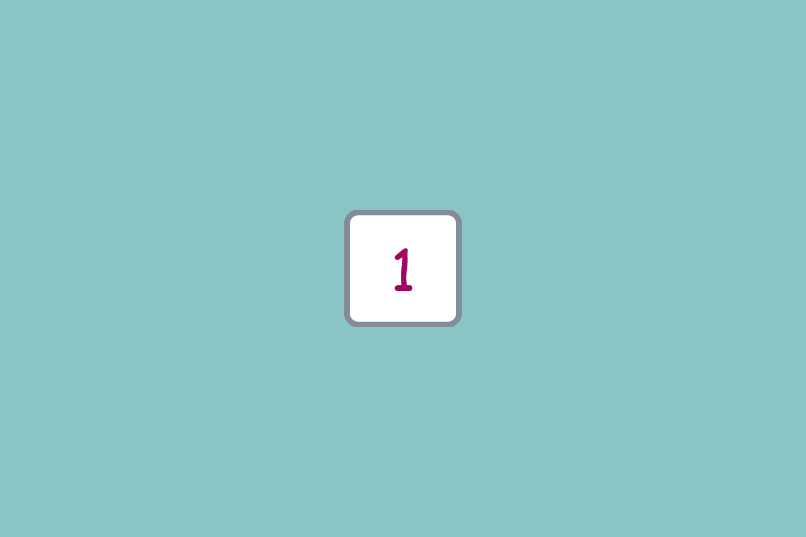
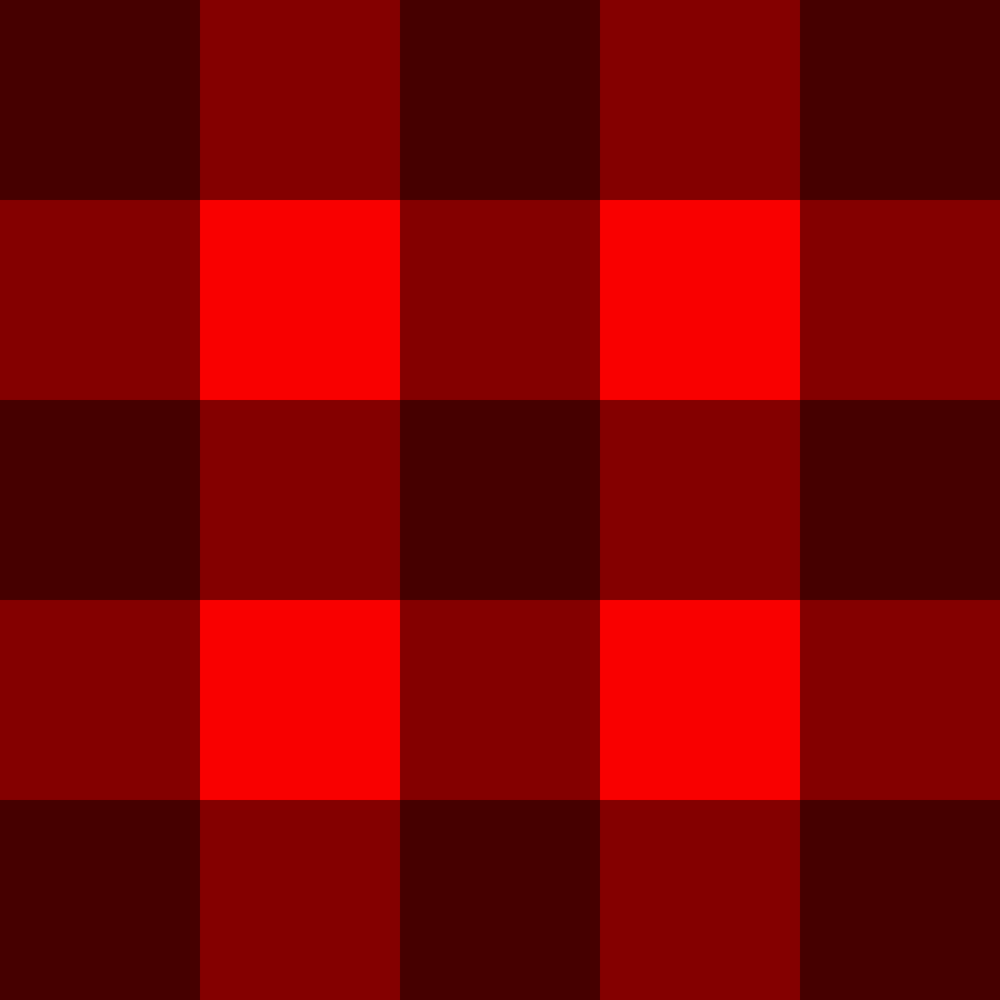
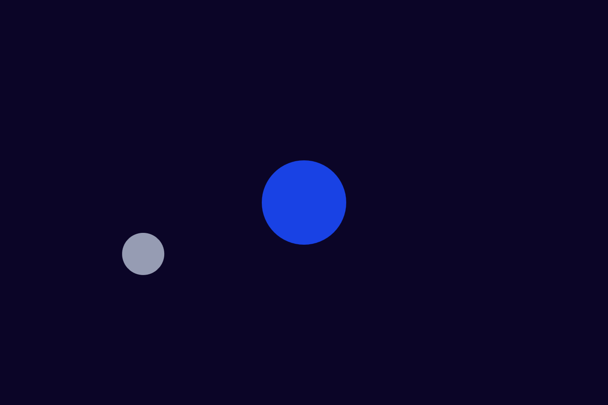
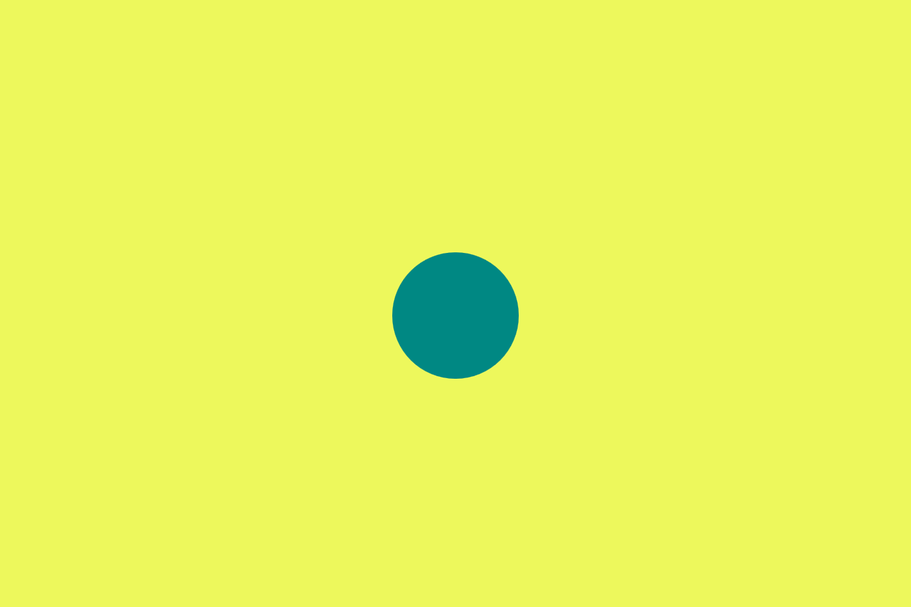
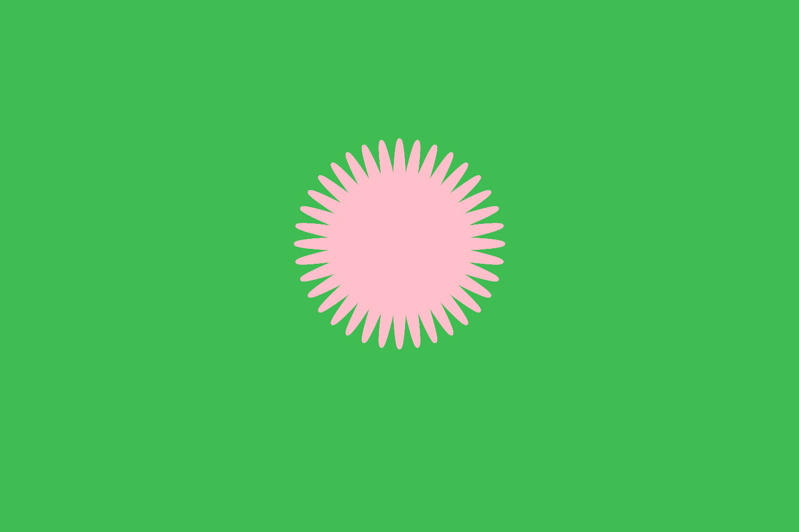

---
This website is a collection the prototyping work done in the CART253 course. It also serves as a way to document my progress at coding.

# Prototypes
## Instructions | [Journal Entry](https://m4820.github.io/cart253/journal#entry-2)
### Numbered Die

[Website Version](https://m4820.github.io/cart253/prototypes/instructions/drawing1) | [Repository](https://github.com/M4820/cart253/tree/main/prototypes/instructions/drawing1)

### Rubber Duck

[Website Version](https://m4820.github.io/cart253/prototypes/instructions/drawing2) | [Repository](https://github.com/M4820/cart253/tree/main/prototypes/instructions/drawing2)

### Flannel Pattern

[Website Version](https://m4820.github.io/cart253/prototypes/instructions/drawing3) | [Repository](https://github.com/M4820/cart253/tree/main/prototypes/instructions/drawing3)

## Variables | [Journal Entry](https://m4820.github.io/cart253/journal#entry-3)
### Floating Balloon

[Website Version](https://m4820.github.io/cart253/prototypes/variables/var1/) | [Repository](https://github.com/M4820/cart253/tree/main/prototypes/variables/var1)

### Orbiting Moon

[Website Version](https://m4820.github.io/cart253/prototypes/variables/var2/) | [Repository](https://github.com/M4820/cart253/tree/main/prototypes/variables/var2)

### Rainy Cloud

[Website Version](https://m4820.github.io/cart253/prototypes/variables/var3/) | [Repository](https://github.com/M4820/cart253/tree/main/prototypes/variables/var3)

## Conditionals | [Journal Entry](https://m4820.github.io/cart253/journal#entry-4)
### Color Change

[Website Version](https://m4820.github.io/cart253/prototypes/conditionals/cond1/) | [Repository](https://github.com/M4820/cart253/tree/main/prototypes/conditionals/cond1)

### Falling Ball

[Website Version](https://m4820.github.io/cart253/prototypes/conditionals/cond2/) | [Repository](https://github.com/M4820/cart253/tree/main/prototypes/conditionals/cond2)

### Growing Flower

[Website Version](https://m4820.github.io/cart253/prototypes/conditionals/cond3/) | [Repository](https://github.com/M4820/cart253/tree/main/prototypes/conditionals/cond3)

### Links
---
* [Repository](https://github.com/M4820/cart253)
* [Journal](https://m4820.github.io/cart253/journal)

