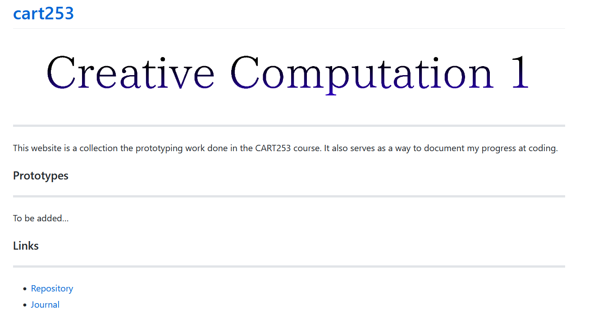
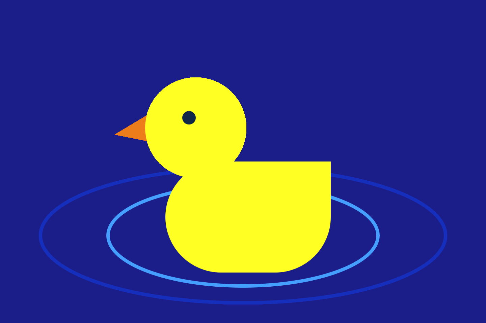

# Reflective Journal

## Entry 1

### 12/09/2026

This is my first time making a website using Markdown and Github. It reminded me a bit of the little amount of HTML I've done in the past. I found it to be pretty straightforward. Although, the different steps with GitHub were a bit challenging to grasp at first, but I feel like I'm getting the hang of it...

It's egregiously minimalist. I have an affinity for simple-looking websites, but I admit that it could look better. For example, the banner is so simple that it probably just looks like a placeholder... I hope that as time goes on, I can get better at customizing websites... but also more generally, get a better grasp on web design in general. This is really only an early stage of it, and as time goes on and my skillset develops, I will definitely attempt to revamp it.

I tend to value functionality over how a website actually looks, but in this case, it looks so simple because of my lack of knowledge... I'd rather have it looking simple for a more intentional reason.

I hope that for now at least, preserving the state of this website at this stage will help to show in the future how much it has changed... Basically, it would demonstrate how far it came along. It's a bit like setting the stage for my eventual improvement in skill at website making and coding in general... I'm looking forward to it.

Here's a capture of current state of it. It can only get better from here on out...

## Entry 2

### 22/09/2026

#### Instructions Assignment

I really wanted to have at least one of my prototypes be interactive, something simple like being able to be clicked.. 

My first idea was the rubber duck. I really tried to have a sound effect play whenever it was clicked, but I wasn't able to do it... For the water ripples, wouldn't it be cool if it was a looping animation? I don't know how to do that either, but I hope that the drawing at least gives an impression of how it would look like.

The die is pretty rudimentary, but I was surprised by the end result. This is probably the most complex thing I've done so far, even though the code itself could be sleeker... Although I did simplify my initial idea by having it be numbered instead of drawing pips. The thought of drawing all those individual pips and figuring out how to display them according to each number though... That is way out of my league right now. But I'd like to revisit that idea someday.

I want to learn to make more interactive stuff like that, buttons, basically... A button that plays a sound, I would have done something simple like that. But like I said, I just couldn't get the sound effect to play ! ! ! That frustrated me so much... I'm probably making a really obvious and silly mistake though or something like that. Even displaying an image, I struggled with that too. So it's something specific to media files, maybe? No idea... But I'll definitely try and figure it out.