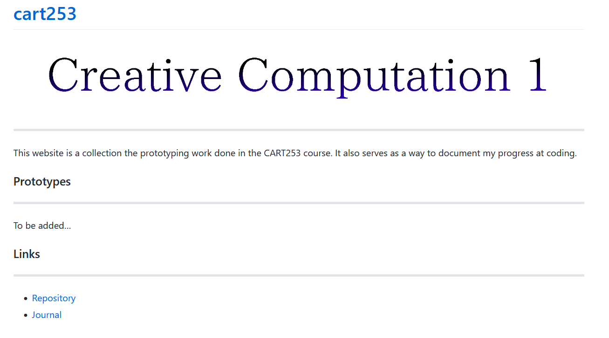
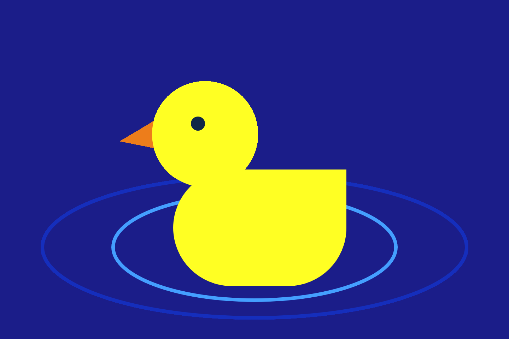
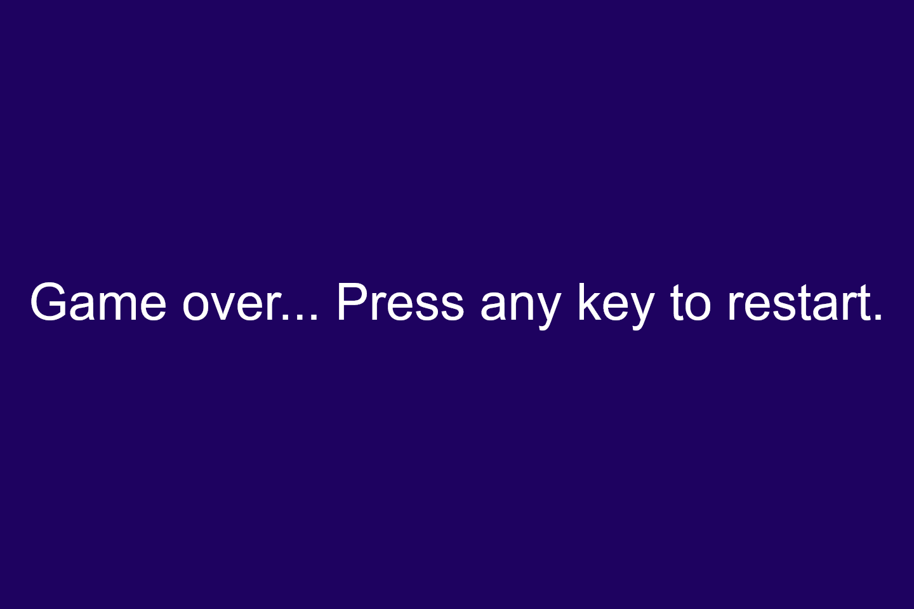

# Reflective Journal

## Entry 1

### 12/09/2026

This is my first time making a website using Markdown and Github. It reminded me a bit of the little amount of HTML I've done in the past. I found it to be pretty straightforward. Although, the different steps with GitHub were a bit challenging to grasp at first, but I feel like I'm getting the hang of it...

It's egregiously minimalist. I have an affinity for simple-looking websites, but I admit that it could look better. For example, the banner is so simple that it probably just looks like a placeholder... I hope that as time goes on, I can get better at customizing websites... but also more generally, get a better grasp on web design in general. This is really only an early stage of it, and as time goes on and my skillset develops, I will definitely attempt to revamp it.

I tend to value functionality over how a website actually looks, but in this case, it looks so simple because of my lack of knowledge... I'd rather have it looking simple for a more intentional reason.

I hope that for now at least, preserving the state of this website at this stage will help to show in the future how much it has changed... Basically, it would demonstrate how far it came along. It's a bit like setting the stage for my eventual improvement in skill at website making and coding in general... I'm looking forward to it.

Here's a capture of current state of it. It can only get better from here on out...

## Entry 2

### 22/09/2026

#### Instructions Assignment

I really wanted to have at least one of my prototypes be interactive, something simple like being able to be clicked.. 

My first idea was the rubber duck. I really tried to have a sound effect play whenever it was clicked, but I wasn't able to do it... For the water ripples, wouldn't it be cool if it was a looping animation? I don't know how to do that either, but I hope that the drawing at least gives an impression of how it would look like.

The die is pretty rudimentary, but I was surprised by the end result. This is probably the most complex thing I've done so far, even though the code itself could be sleeker... Although I did simplify my initial idea by having it be numbered instead of drawing pips. The thought of drawing all those individual pips and figuring out how to display them according to each number though... That is way out of my league right now. But I'd like to revisit that idea someday. Also, for the mouse press, surely there's a way to have it change numbers when only the die is clicked, rather than the entire canvas...

I want to learn to make more interactive stuff like that, buttons, basically... A button that plays a sound, I would have done something simple like that. But like I said, I just couldn't get the sound effect to play ! ! ! That frustrated me so much... I'm probably making a really obvious and silly mistake though or something like that. Even displaying an image, I struggled with that too. So it's something specific to media files, maybe? No idea... But I'll definitely try and figure it out.

## Entry 3

### 29/09/2026

#### Variables Assignment

I continued trying to make "interactive" prototypes.
For the balloon one, I think it has potential to be game-like. Something like trying to drag the balloon down before it can fly away. My initial idea was just to have the balloon flying off-screen, but I think that it would have been better if I found a way to make the string grabbable. I also think it would be cool to animate the string, with like a sine wave animation or something...

The cloud is also interactive. It's a bit like a button. Still, the mouse press affects the entire canvas... I also wanted to put a limit to the brightness and darkness of the cloud, but I struggled with that... I'm happy with how the rain turned out though, even though it's pretty silly-looking.

The one that's not interactive at all is the orbiting moon. My initial idea was a fan (that could hopefully be interactive, by pressing the mouse, the blades of the fan would turn.) But the rotation was a bit difficult to figure out... especially since I had 3 rotating blades in mind. But as I was making it, I thought that it looked a bit like an orbiting moon or something. So, I just went along with that instead... Maybe one day, I can come back to that fan idea...

I still want to keep making interactable stuff like that. Last week, I only made one, but this time at least, there were 2! Maybe it can go up to 3 one day..?

## Entry 4

### 29/09/2026

#### Conditionals Assignment

When I added all the images together, I noticed how similar they all ended up looking... I think that next time, I should try to have some more variety visually...

This time, I was able to make all 3 interactable!!! The second one is the most "game-like". Although, a lot of improvements could be made to it. For example, I wanted to have it restart once it reached the game over screen. But I couldn't get the ball to get back to its initial state...

Additionally, I think it would be cool if the speed of the ball changed as it was falling. That's kind of what I had in mind when making the speeds different, but it's not fantastic right now... I couldn't figure it out... In any case, I really wanted to try out game states for at least one of the prototypes.

I think that the flower one is cool too! It kind of looks like it has a low framerate in a nice way. It looks animated, I think... There are a lot of cool effects that can be done with rotating shapes. This one involved a lot of experimentation.

The color changing one is simple. I like arrow key-based movement in general... That's what I had in mind when making it.

I think there's a lot of room for improvement, as always... especially when it comes to the game-like one. I want to make something fun...! This one is maybe not so fun.
